<div align="center">

# 🤖 MARS: Multi-Agent Robotic System
### Design and Implementation of Smart Navigation and Coordination System for AI-Driven Heterogeneous Multi-Agent Robotic Systems

[](https://docs.ros.org/en/humble/)
[](https://www.python.org/)
[](https://isocpp.org/)
[](https://www.docker.com/)
[](https://github.com/ultralytics/ultralytics)
[](https://nav2.org/)
[](https://micro.ros.org/)
[](https://developer.nvidia.com/cuda-toolkit)

**Bachelor's Graduation Project — Sana'a University, Faculty of Engineering**  
*Electrical Engineering · Computer and Control Engineering · 2026*

---

<!-- BANNER 1 -->
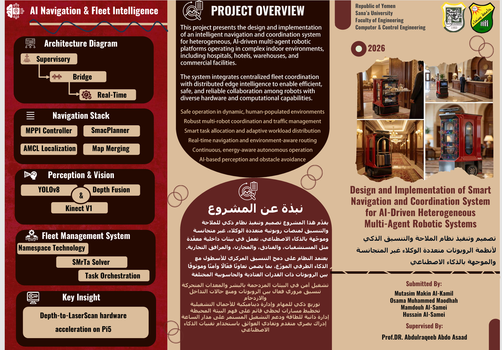

---

<!-- BANNER 2 -->
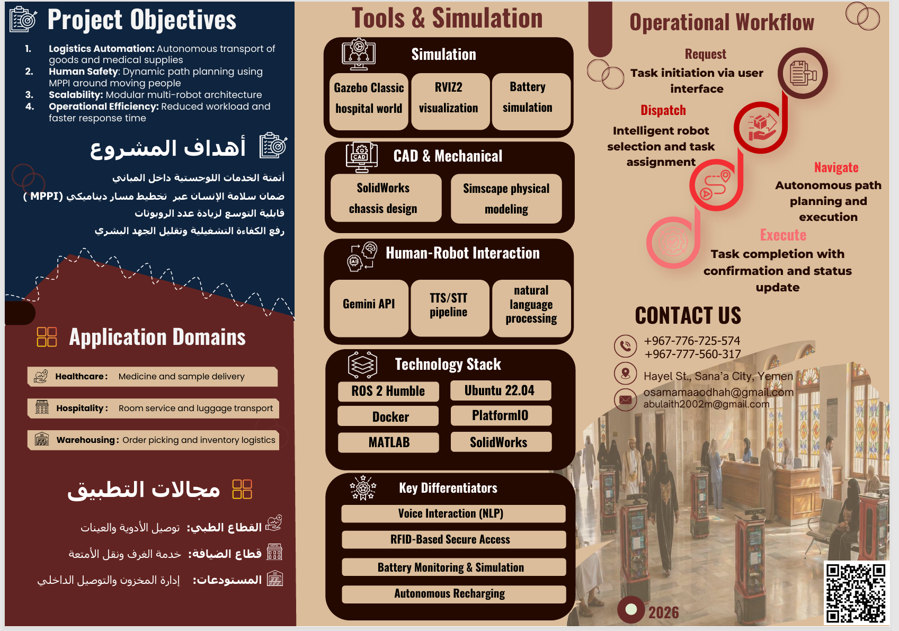

</div>

---

## 📋 Table of Contents

- [Project Overview](#-project-overview)
- [Physical Prototype](#-physical-prototype)
- [System Architecture](#️-system-architecture)
- [Hardware Specifications](#️-hardware-specifications)
- [Mechanical & Hardware Design](#️-mechanical--hardware-design)
- [System Modeling & Simulation](#-system-modeling--simulation)
- [Navigation Stack](#-navigation-stack)
- [Semantic Perception Pipeline](#-semantic-perception-pipeline-yolo--costmap)
- [Sensor Fusion — EKF](#-sensor-fusion--ekf)
- [SLAM & Localization](#️-slam--localization)
- [Transformation Trees (TF)](#-transformation-trees-tf)
- [Fleet Management System](#-fleet-management-system)
- [Fleet Monitoring Dashboard](#-fleet-monitoring--control)
- [Docker Deployment](#-docker-deployment)
- [ROS 2 Topic Reference](#-ros-2-topic-reference)
- [Operational Logic](#-operational-logic)
- [Demo Videos](#-demo-videos)
- [Team](#-team)

---

## 📌 Project Overview

This project presents the design and implementation of an **intelligent navigation and coordination system** for heterogeneous, AI-driven multi-agent robotic platforms. Designed for complex indoor environments such as hospitals, hotels, and warehouses, the system integrates centralized fleet coordination with distributed edge intelligence.

### Key Features:
- **Autonomous Navigation:** GPU-accelerated MPPI local control with Hybrid-A\* global planning and real-time traffic de-confliction.
- **AI Perception:** YOLOv8-based semantic obstacle detection fused into Nav2 costmaps via a custom VoxelLayer observation source.
- **Sensor Fusion:** Extended Kalman Filter combining wheel odometry and IMU for robust, drift-resistant localization.
- **Human-Robot Interaction:** Voice-driven commands using Whisper and Gemini AI.
- **Secure Access:** RFID-based door mechanism for authorized zone entry.
- **Fleet Management:** Battery-aware task allocation, side-spot traffic de-confliction, and fault-tolerant task reallocation.
- **Containerized Deployment:** Full system runs inside Docker for reproducible, dependency-free deployment.

---

## 🤖 Physical Prototype

The project culminated in the construction of two functional robotic units, **KAMIL-01** and **KAMIL-02**, featuring a custom-built chassis and integrated sensor suites.

<div align="center">
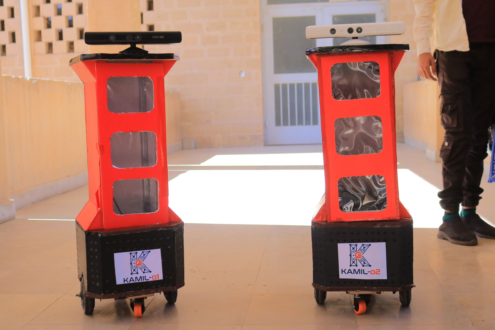
<p><i>KAMIL-01 and KAMIL-02: The physical realization of the MARS project.</i></p>
</div>

---

## 🏗️ System Architecture

The system follows a **Three-Tier Hierarchical Architecture**, ensuring a clear separation between high-level supervisory tasks, mid-level bridge processing, and low-level real-time control.

<div align="center">
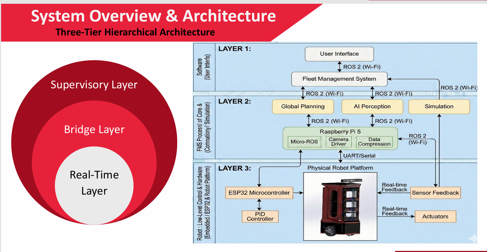
</div>

| Layer | Hardware | Responsibilities |
|---|---|---|
| **Supervisory Layer** | Cloud / Laptop Server | Fleet Management System (FMS), Dashboard GUI, task orchestration |
| **Bridge Layer** | Raspberry Pi 5 | ROS 2 nodes, Nav2 stack, YOLOv8 inference, EKF, map serving |
| **Real-Time Layer** | ESP32 + Micro-ROS | Motor PWM, PID control, encoder odometry, battery ADC, watchdog safety |

The Bridge and Real-Time layers communicate via **DDS-XRCE (Micro-ROS)** over UART/USB serial, while the Supervisory and Bridge layers communicate over **Wi-Fi** using ROS 2 DDS and REST/HTTP.

---

## 🖥️ Hardware Specifications

| Component | Specification |
|---|---|
| **Onboard Computer** | Raspberry Pi 5 (8 GB) |
| **Embedded Controller** | ESP32 (240 MHz dual-core, 520 KB SRAM) |
| **RGB-D Camera** | Intel RealSense D435i (depth range 0.3–3.0 m effective) |
| **IMU** | Integrated IMU via `/robot_name/imu/data` |
| **Drive System** | Differential drive — NEMA17 stepper motors + quadrature encoders |
| **Motor Driver** | DRV8833 (or equivalent) — PWM via ESP32 LEDC channels |
| **Power System** | 3S LiPo 11.1V with dedicated 5V regulated supply for compute |
| **Robot Footprint** | 44 cm × 38 cm rectangular chassis |
| **Max Linear Velocity** | 0.5 m/s |
| **Communication** | Wi-Fi 802.11n to fleet server; UART serial to ESP32 |
| **GPU (Simulation/Inference)** | NVIDIA RTX 4060 (used for CUDA-accelerated MPPI planning) |

---

## ⚙️ Mechanical & Hardware Design

### Mechanical Design Process
The robot chassis was designed with a modular approach, focusing on ease of maintenance and structural integrity. The design transitioned from 2D schematics to 3D SolidWorks models, followed by physical fabrication using 3D printing for structural components.

<div align="center">
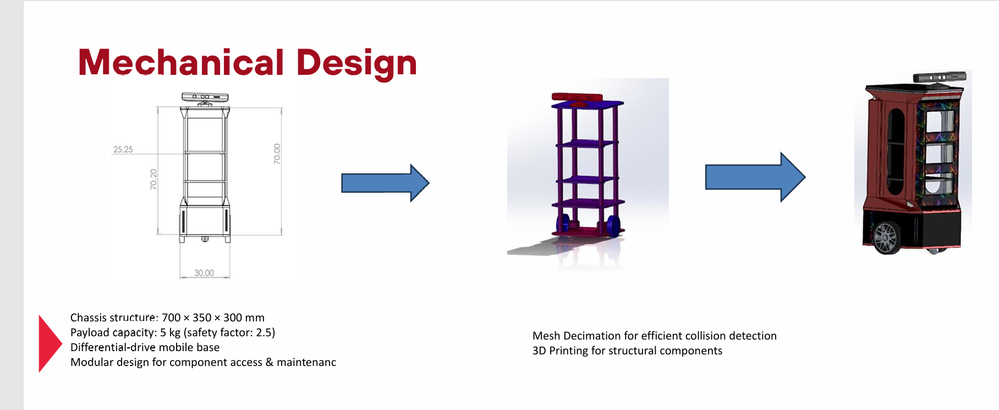
</div>

### Differential Drive Assembly
The locomotion system utilizes a differential drive mobile base with NEMA17 stepper motors and closed-loop encoder feedback for precise odometry.

<div align="center">
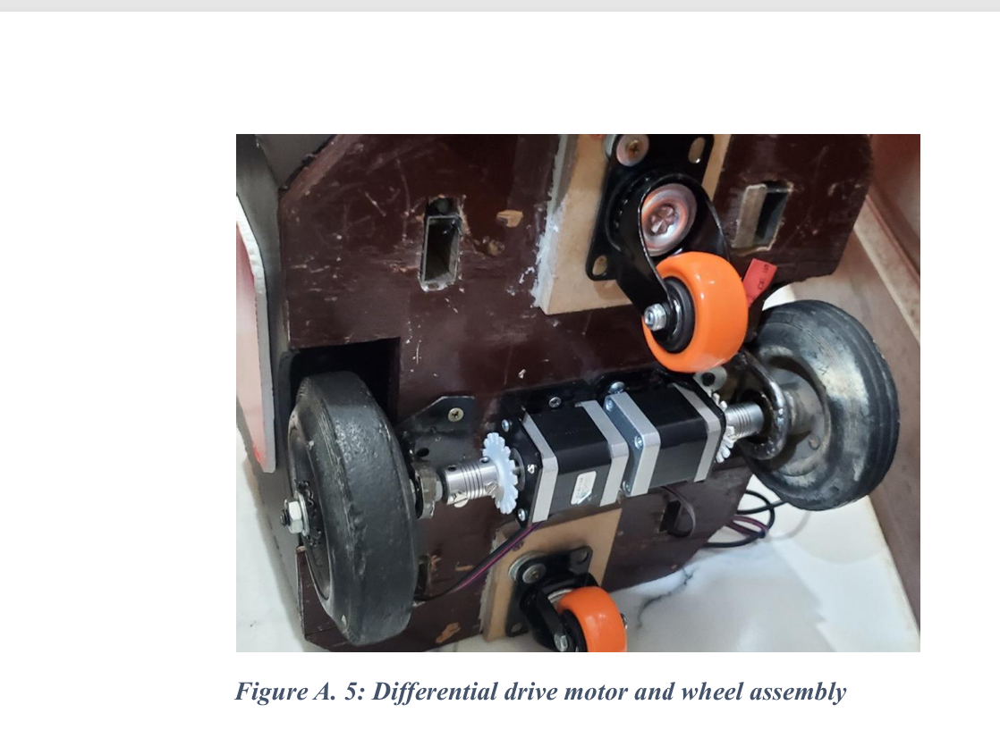
</div>

---

## 📊 System Modeling & Simulation

### Mathematical Modeling
Extensive system modeling was performed using MATLAB/Simulink to validate the kinematics and control logic before deployment.

<div align="center">
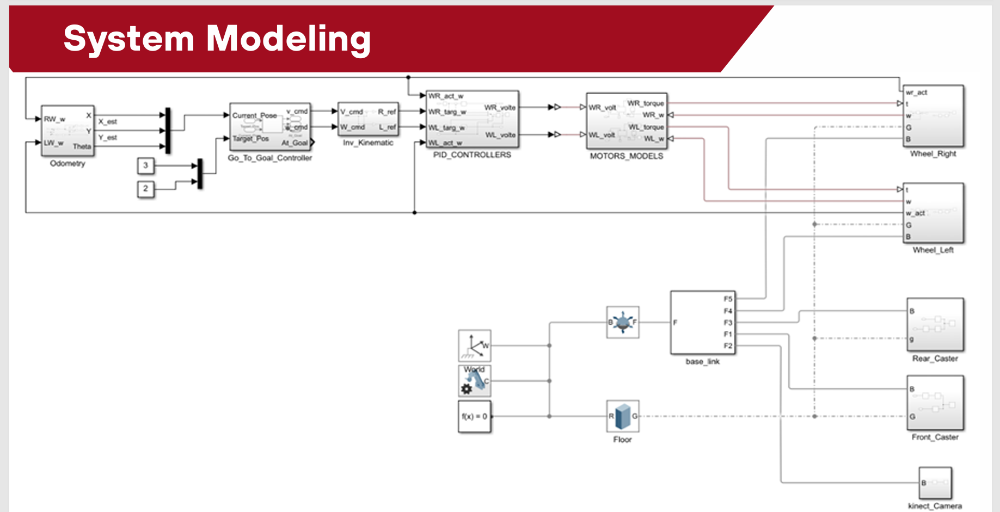
</div>

### Simulation Environment
The system was rigorously tested in a **Gazebo Hospital World**, allowing for the evaluation of multi-robot scenarios, navigation stacks, and perception pipelines in a safe, reproducible environment.

<div align="center">
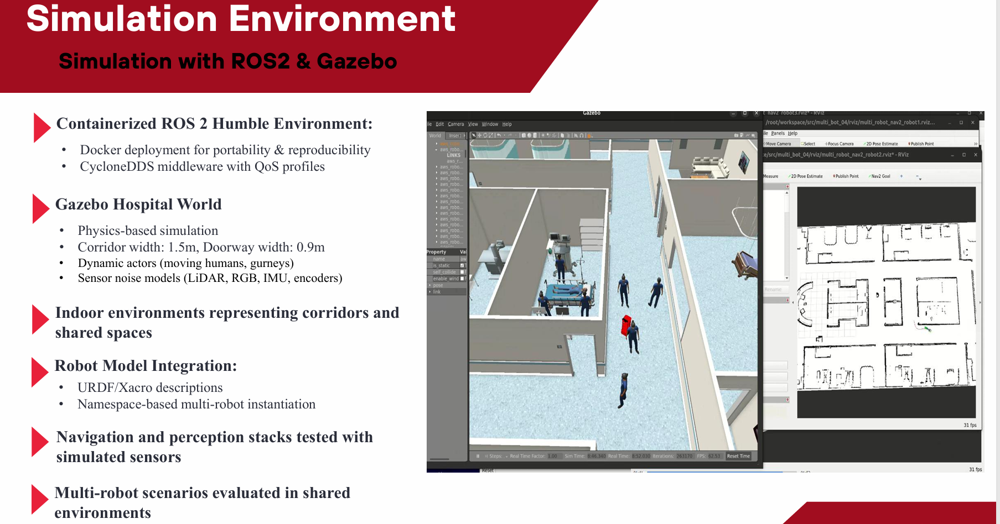
</div>

---

## 🧭 Navigation Stack

MARS uses the full **Nav2** navigation framework configured for multi-robot deployment, with every parameter file using a `robot_name` substitution token — meaning a **single shared YAML drives all robots** while maintaining independent namespaced topics and TF frames.

### Global Planner — Smac Hybrid-A\*

The global planner uses `nav2_smac_planner/SmacPlannerHybrid` with:
- **Reeds-Shepp motion model** — considers reverse arcs for kinematically feasible paths
- **72 angle quantization bins** for fine heading resolution
- **0.2 m minimum turning radius** enforcing smooth car-like curves
- Integrated **path smoother** (1000 iterations, w_smooth=0.3, w_data=0.2)
- `reverse_penalty: 2.0` to prefer forward driving while still allowing reverse when necessary

### Local Planner — MPPI Controller (GPU-Accelerated)

The local planner uses `nav2_mppi_controller::MPPIController` with **CUDA acceleration** targeting an NVIDIA RTX 4060:

| Parameter | Value | Purpose |
|---|---|---|
| `batch_size` | 600 | Trajectory samples per planning cycle |
| `time_steps` | 32 | Planning horizon steps |
| `model_dt` | 0.1 s | Time per step (3.2 s lookahead) |
| `device` | `cuda` | GPU acceleration enabled |
| `motion_model` | `DiffDrive` | Differential drive kinematics |
| `vx_max` | 0.5 m/s | Maximum forward velocity |
| `wz_max` | 1.9 rad/s | Maximum angular velocity |

#### MPPI Critic Stack (8 Active Critics)

The MPPI controller evaluates each sampled trajectory against 8 simultaneous cost critics:

| Critic | Weight | Role |
|---|---|---|
| `ConstraintCritic` | 4.0 | Kinematic feasibility enforcement |
| `CostCritic` | 3.81 | Costmap obstacle avoidance (collision cost: 1,000,000) |
| `GoalCritic` | 5.0 | Progress toward goal position |
| `GoalAngleCritic` | 3.0 | Final heading alignment |
| `PathAlignCritic` | 6.0 | Global path alignment (highest weight) |
| `PathFollowCritic` | 5.0 | Staying close to the reference path |
| `PathAngleCritic` | 2.0 | Heading consistency along path |
| `PreferForwardCritic` | 5.0 | Penalizes unnecessary backward motion |

> The `CostCritic` includes footprint-aware collision checking and short-circuits trajectory evaluation early when a collision is detected, saving GPU compute.

### Costmap Design — Asymmetric Inflation Strategy

A deliberate asymmetry is applied between the two costmap layers:

| | Local Costmap | Global Costmap |
|---|---|---|
| **Inflation Radius** | 0.55 m | 0.9 m |
| **Cost Scaling Factor** | 5.0 | 10.0 |
| **Obstacle Layer** | VoxelLayer (3D) | ObstacleLayer (2D) |
| **Update Rate** | 4.0 Hz | 5.0 Hz |
| **Purpose** | Responsive local avoidance | Conservative long-range planning |

The local costmap uses a **VoxelLayer** (16 voxels tall, 0.2 m z-resolution, max 2 m height) for true 3D obstacle representation, while the global costmap uses a flat 2D ObstacleLayer for efficient long-range path computation.

### Keepout Filter — Restricted Zones

Both costmaps apply a **KeepoutFilter** plugin loading a `keepout_mask.yaml` file, enforcing hard no-go zones (e.g., restricted wards, operating rooms, hazardous areas). This is configured per-robot via namespaced `/robot_name/costmap_filter_info` and `/robot_name/keepout_filter_mask` topics.

### Recovery Behaviors

The **Behavior Server** provides three recovery plugins executed by the Nav2 Behavior Tree when navigation fails:

- **Spin** — rotates in place to clear local costmap
- **BackUp** — reverses to escape tight situations
- **Wait** — pauses for dynamic obstacles to clear

The Behavior Tree (`navigate_to_pose_w_replanning_and_recovery.xml`) orchestrates replanning and recovery automatically, with 30+ BT node plugins loaded including `nav2_is_battery_low_condition_bt_node` for battery-triggered behaviors.

---

## 👁️ Semantic Perception Pipeline (YOLO → Costmap)

One of MARS's core contributions is the direct integration of AI object detection into the Nav2 navigation planner. The pipeline works as follows:

```
RGB-D Camera
     │
     ├──► Color Image ──► YOLOv8 Detection ──► Bounding Boxes + Class Labels
     │                                                      │
     └──► Depth Image ──► Depth Association ──► 3D Point Projection
                                                            │
                                              Camera Frame → Base Frame → Map Frame (via TF)
                                                            │
                                              Published as PointCloud2
                                              on /robot_name/detected_object_pose
                                                            │
                                              VoxelLayer: yolo_marking observation source
                                                            │
                                              Nav2 Local Costmap (2s persistence)
                                                            │
                                              MPPI Controller applies semantic costs
```

### Key Design Details

- **Bounding box → depth association:** Median depth is sampled from the central 50% of depth pixels within each bounding box, rejecting boundary artifacts and occluded background pixels.
- **3D back-projection** uses camera intrinsics (focal length, principal point) from the `CameraInfo` topic to convert `(u, v, depth)` → `(X, Y, Z)` in camera frame.
- **TF transformation** converts the 3D point from camera frame → `base_link` → global `map` frame using AMCL pose.
- **Class-specific inflation radii** are applied: humans receive 0.8 m clearance (proxemic safety), furniture 0.3 m, unknown objects 0.5 m.
- **2-second obstacle persistence** (`observation_persistence: 2.0`) keeps detected humans visible in the costmap even if briefly missed by the detector.
- **Complementary source roles:** YOLO **marks** obstacles, laser scan **clears** them — preventing ghost obstacles from lingering.

---

## 📡 Sensor Fusion — EKF

The `robot_localization` Extended Kalman Filter (EKF) runs at **20 Hz** in 2D mode, fusing two sensor streams for robust, drift-resistant localization:

### Odometry Source (`odom0`)
- Topic: `/robot_name/wheel/odometry`
- Contributes: **position (x, y, z)** and **linear/angular velocities**
- Differential mode: `false` (absolute odometry used)

### IMU Source (`imu0`)
- Topic: `/robot_name/imu/data`
- Contributes: **roll, pitch, yaw**, all **angular velocities**, all **linear accelerations**
- `imu0_relative: true` — orientation treated as relative change (no magnetometer dependency)
- Gravity removal enabled (`imu0_remove_gravitational_acceleration: true`)

### EKF Configuration

| Parameter | Value |
|---|---|
| Filter frequency | 20 Hz |
| Mode | 2D (planar) |
| World frame | `robot_name/odom` |
| State vector size | 15 states (x, y, z, roll, pitch, yaw + derivatives + accelerations) |
| Acceleration limits | Linear: 1.3 m/s², Angular: 3.4–4.5 rad/s² |

The fused odometry output feeds directly into AMCL for particle filter pose estimation, and is consumed by the Nav2 controller server for velocity command feedback.

---

## 🗺️ SLAM & Localization

The robots utilize **SLAM Toolbox** for real-time mapping and **AMCL** for precise localization. A key contribution is the **Multi-Robot Map Merging** capability, allowing multiple robots to build and share a unified map of the environment.

<div align="center">
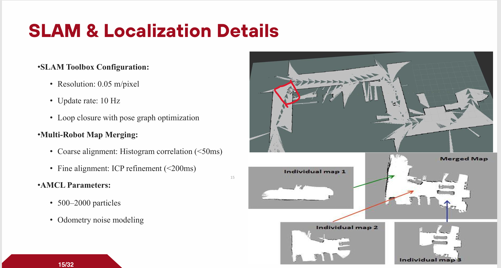
</div>

### SLAM Toolbox Configuration
- **Solver:** Ceres Solver with `SPARSE_NORMAL_CHOLESKY` + Levenberg-Marquardt trust region
- **Loop closure:** Enabled — minimum chain size of 10 nodes, fine response threshold 0.45
- **Map resolution:** 0.05 m/cell
- **Max laser range:** 12.0 m
- **Mode:** Online asynchronous mapping

### AMCL Localization
- **Motion model:** `nav2_amcl::DifferentialMotionModel`
- **Laser model:** `likelihood_field`
- **Particle count:** 500–2000 (adaptive)
- **Transform tolerance:** 3.0 s (accommodates multi-robot TF latency)
- **Update thresholds:** 0.25 m linear / 0.2 rad angular (prevents unnecessary particle updates)

---

## 🌳 Transformation Trees (TF)

The MARS project utilizes a structured coordinate frame system to manage spatial relationships between the world, robots, and their individual sensors.

### 1. Multi-Agent Configuration (With Namespacing)
In a multi-robot setup, namespacing is critical to avoid frame ID collisions. Each robot operates within its own namespace (e.g., `robot1`, `robot2`), allowing the Fleet Management System to track multiple agents simultaneously in a global `world` frame.

<div align="center">
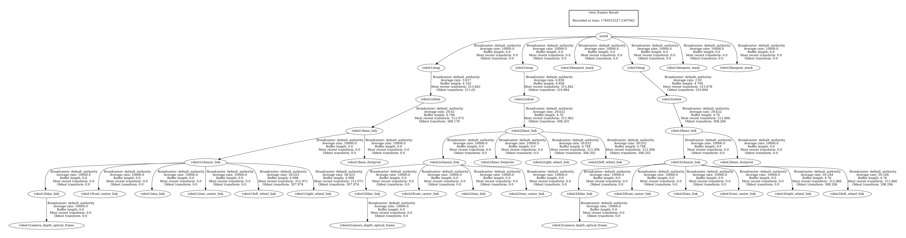
<p><i>Figure: TF Tree for a 3-robot heterogeneous fleet with namespacing.</i></p>
</div>

**Key Characteristics:**
- **Global Root:** The `world` frame serves as the common origin for all agents.
- **Namespaced Frames:** Each robot has its own `map`, `odom`, and `base_link` prefixed with its unique ID (e.g., `robot1/base_link`).
- **Independent Odometry:** Each agent maintains its own localized odometry chain within its namespace.
- **Single shared config:** All robots use one `nav2_params_multi.yaml` file — the `robot_name` token is substituted at launch time per robot.

### 2. Single-Agent Configuration (Without Namespacing)
For individual robot testing or single-agent deployments, a standard non-namespaced TF tree is used. This simplifies the configuration for standalone tasks.

<div align="center">
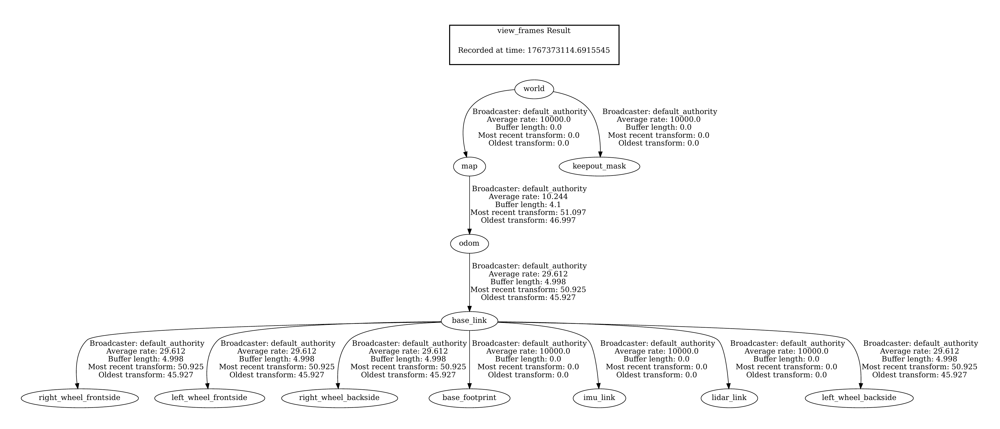
<p><i>Figure: Standard TF Tree for a single MARS agent.</i></p>
</div>

**Key Characteristics:**
- **Standard ROS Convention:** Follows the `map` → `odom` → `base_link` hierarchy.
- **Direct Sensor Links:** Sensors like `lidar_link` and `imu_link` are attached directly to the `base_link`.
- **Simplified Logic:** Ideal for initial calibration and single-robot SLAM validation.

---

## 🧠 Fleet Management System

The Fleet Manager runs as a native ROS 2 node, orchestrating the entire multi-robot fleet through several coordinated subsystems.

### Battery-Aware Task Allocation

Robot selection uses a composite cost function that balances proximity and battery health:

```
combined_score = euclidean_distance(robot → pickup) − (battery_level / 10.0)
```

Robots are excluded from selection if:
- Battery ≤ 15% (critical threshold — must charge)
- Status is `error` or `recovering`
- Currently occupying a side spot
- Estimated task energy exceeds available battery minus safety margin

### Battery Management

| Threshold | Level | Behavior |
|---|---|---|
| Normal | > 30% | Standard operation |
| Warning | 15–30% | Orange indicator, tasks still accepted |
| Critical | ≤ 15% | Task blocked, auto-return to charging station triggered |
| Charging | At parking spot | 1%/second charge rate, only starts at critical threshold |
| Consumption | During movement | 0.05% per meter traveled (tracked from AMCL pose deltas) |

### Traffic De-confliction — Side Spot System

When a robot's target location is occupied (within 2.0 m of another robot), the Fleet Manager automatically de-conflicts:

1. Identifies the blocking robot
2. Cancels the blocking robot's current goal
3. Redirects it to a pre-mapped **side spot** adjacent to the contested location
4. The requesting robot proceeds to the now-clear destination
5. A **30-second timeout** returns the displaced robot to its original task

Five side spots are mapped to their corresponding main nodes (e.g., Lobby → Lobby Side, Ward A → Ward A Out).

### Collision Recovery

- Consecutive navigation failures are counted per robot
- At **5 failures**, a collision is declared
- Goal is cancelled and a recovery timer retries the last navigation goal
- Up to **3 retry attempts** before the task is dropped and requeued
- Status transitions: `busy` → `recovering` → `idle` (on success) or `error` (on max retries)

### Task Lifecycle

```
PENDING → ASSIGNED → IN_PROGRESS → COMPLETED
                  ↘              ↗
                    FAILED → reallocated to next available robot
```

- **Opportunistic dispatch:** If a robot is returning to parking and a new task arrives (and battery > 15%), the parking route is cancelled immediately and the task is dispatched.
- **Smart Skip:** If a chained task's pickup location matches the robot's current position, the pickup navigation phase is skipped entirely.
- **Dropoff-Only mode:** Tasks with no pickup navigate directly to the dropoff, supported in both CSV and JSON task formats.

### Task Input Formats

The fleet manager accepts two task submission formats simultaneously:

```
# CSV format (via /task_commands)
assign,robot1,Ward A,Room 1,T123456-1

# JSON format (via /fleet/submit_task)
{"pickup": "Ward A", "dropoff": "Room 1", "task_id": "T123456-1"}
```

---

## 🎮 Fleet Monitoring & Control

The **RoboFleet Command Center** is a desktop GUI providing centralized monitoring and control, built with **CustomTkinter** (falling back to standard Tkinter if unavailable).

<div align="center">
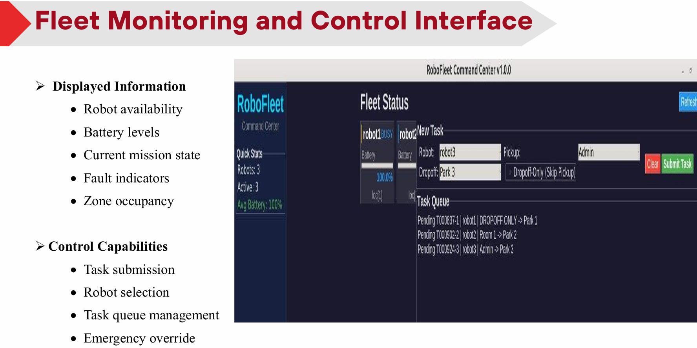
</div>

### Dashboard Features
- **Dual-mode operation:** Runs standalone in **Mock Mode** (no ROS 2 required) or connects live in **ROS 2 Mode** (`--ros2` flag)
- **Per-robot cards:** Real-time status, battery progress bar with color-coded thresholds (green >30%, orange 15–30%, red <15%), and current location
- **Task submission form:** Robot selector (manual or auto-assign), pickup/dropoff dropdowns across 26 hospital waypoints, Dropoff-Only checkbox
- **Task queue panel:** Live view of pending, assigned, and in-progress tasks
- **Sidebar stats:** Total robots, active task count, fleet average battery

### Launch

```bash
# Mock mode (no ROS 2 needed)
python3 fleet_dashboard.py

# ROS 2 live mode
python3 fleet_dashboard.py --ros2
```

---

## 🐳 Docker Deployment

The entire MARS software stack runs inside a **Docker container**, ensuring a consistent, reproducible environment with no manual dependency management.

### Prerequisites
- Docker Engine 24.0+
- NVIDIA Container Toolkit (for GPU-accelerated MPPI planning)
- Host: Ubuntu 22.04 recommended

### Quick Start

```bash
# Clone the repository
git clone https://github.com/Asoomkamel/MARS-Multi-Agent-Robotic-System.git
cd MARS-Multi-Agent-Robotic-System

# Build the Docker image
docker build -t mars-ros2 .

# Run the container (with GPU and display support)
docker run -it --rm \
  --gpus all \
  --network host \
  --env DISPLAY=$DISPLAY \
  --volume /tmp/.X11-unix:/tmp/.X11-unix \
  --device /dev/ttyUSB0:/dev/ttyUSB0 \
  mars-ros2

# Inside the container — launch the full multi-robot stack
ros2 launch mars_bringup multi_robot.launch.py robot_names:="[robot1,robot2,robot3]"

# Launch the fleet dashboard (separate terminal)
python3 fleet_dashboard.py --ros2
```

> **Note:** Pass `--device /dev/ttyUSB0` (or the appropriate port) to expose the ESP32 serial connection to the container. Use `xhost +local:docker` on the host before launching if RViz2 or Gazebo windows do not appear.

### Container Contents
- ROS 2 Humble + Nav2 full stack
- SLAM Toolbox + robot_localization (EKF)
- YOLOv8 (Ultralytics) + Intel RealSense SDK
- Micro-ROS agent
- Fleet Manager + Dashboard GUI dependencies

---

## 📡 ROS 2 Topic Reference

| Topic | Message Type | Direction | Description |
|---|---|---|---|
| `/task_commands` | `std_msgs/String` (CSV) | Dashboard → Fleet Manager | Task assignment in CSV format |
| `/fleet/submit_task` | `std_msgs/String` (JSON) | Dashboard → Fleet Manager | Task assignment in JSON format |
| `/fleet_dashboard/status` | `std_msgs/String` (JSON) | Fleet Manager → Dashboard | Full robot state at 2 Hz |
| `/fleet_battery_status` | `std_msgs/String` (JSON) | Fleet Manager → Dashboard | Battery levels at 1 Hz |
| `/fleet_status` | `std_msgs/String` | Fleet Manager → Monitor | Human-readable fleet status |
| `/robot_name/detected_object_pose` | `sensor_msgs/PointCloud2` | YOLO node → Costmap | Semantic obstacle positions |
| `/robot_name/amcl_pose` | `geometry_msgs/PoseWithCovarianceStamped` | AMCL → Fleet Manager | Robot localization pose |
| `/robot_name/scan` | `sensor_msgs/LaserScan` | RGB-D → Nav2 | Depth-to-LaserScan converted data |
| `/robot_name/navigate_to_pose` | `nav2_msgs/action/NavigateToPose` | Fleet Manager → Nav2 | Navigation action goals |
| `/robot_name/cmd_vel_nav` | `geometry_msgs/Twist` | MPPI → Micro-ROS | Velocity commands to ESP32 |
| `/robot_name/wheel/odometry` | `nav_msgs/Odometry` | ESP32 → EKF | Wheel encoder odometry |
| `/robot_name/imu/data` | `sensor_msgs/Imu` | IMU → EKF | Raw IMU measurements |
| `/robot_name/map` | `nav_msgs/OccupancyGrid` | Map Server → Nav2 | Static map for navigation |
| `/robot_name/costmap_filter_info` | `nav2_msgs/CostmapFilterInfo` | Filter Server → Costmap | Keepout zone filter metadata |

---

## 🔄 Operational Logic

The system's operational flow is governed by an **Asynchronous State Machine (ASM)**, coordinating everything from user requests to low-level hardware triggers like RFID door opening.

<div align="center">
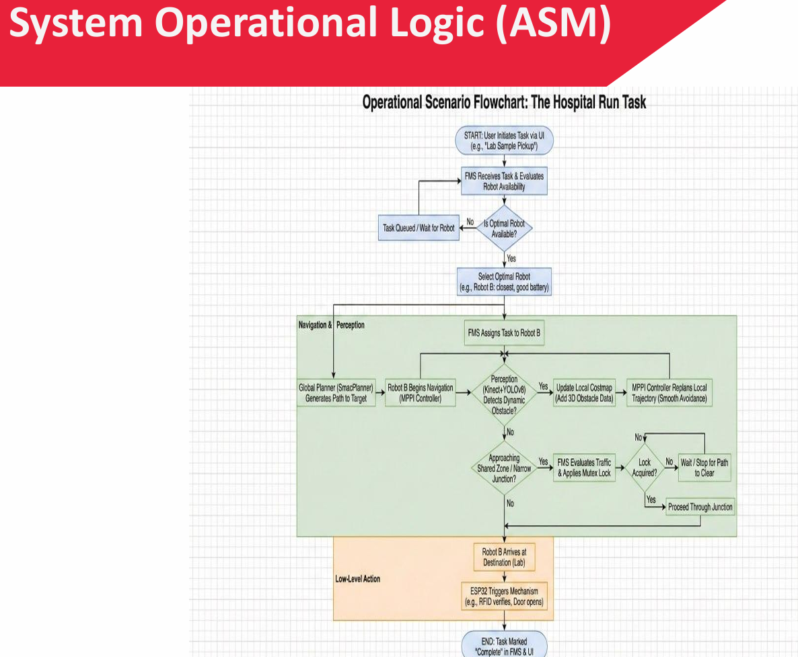
</div>

---

## 🎬 Demo Videos

| Demo | Description | Link |
|------|-------------|------|
| 🗺️ **SLAM Mapping** | Two robots building a shared map in real-time | [Watch →](https://drive.google.com/drive/folders/1-9L6LYLV3B_W_U3SomK1VmOPT8XbXjZW) |
| 🚗 **Autonomous Navigation** | Multi-robot nav with MPPI controller | [Watch →](https://drive.google.com/drive/folders/1-9L6LYLV3B_W_U3SomK1VmOPT8XbXjZW) |
| 👁️ **YOLOv8 Detection** | Live bounding box detection with RGB-D fusion | [Watch →](https://drive.google.com/drive/folders/1-9L6LYLV3B_W_U3SomK1VmOPT8XbXjZW) |
| 🎙️ **Voice HRI** | Natural language command execution | [Watch →](https://drive.google.com/drive/folders/1-9L6LYLV3B_W_U3SomK1VmOPT8XbXjZW) |
| 🔑 **RFID Door Access** | Automated secure door entry | [Watch →](https://drive.google.com/drive/folders/1-9L6LYLV3B_W_U3SomK1VmOPT8XbXjZW) |

---

## 👥 Team

| Name | Student ID |
|------|-----------|
| Mutasim Makin Al-Kamil  " Team's Leader"  | 202270192 |
| Osama Muhammed Maaodhah | 202270222 |
| Mamdouh Abdul Fattah Al-Samei | 202270377 |
| Hussain Abdul Moeen Al-Samei | 202270380 |

**Supervisor:** Prof. Dr. Abdulraqib Abdo Asaad  
**Institution:** Sana'a University — Faculty of Engineering

---

<div align="center">

**⭐ If this project inspired you, please give it a star!**

*Built with passion by engineering students from Yemen 🇾🇪*

</div>
