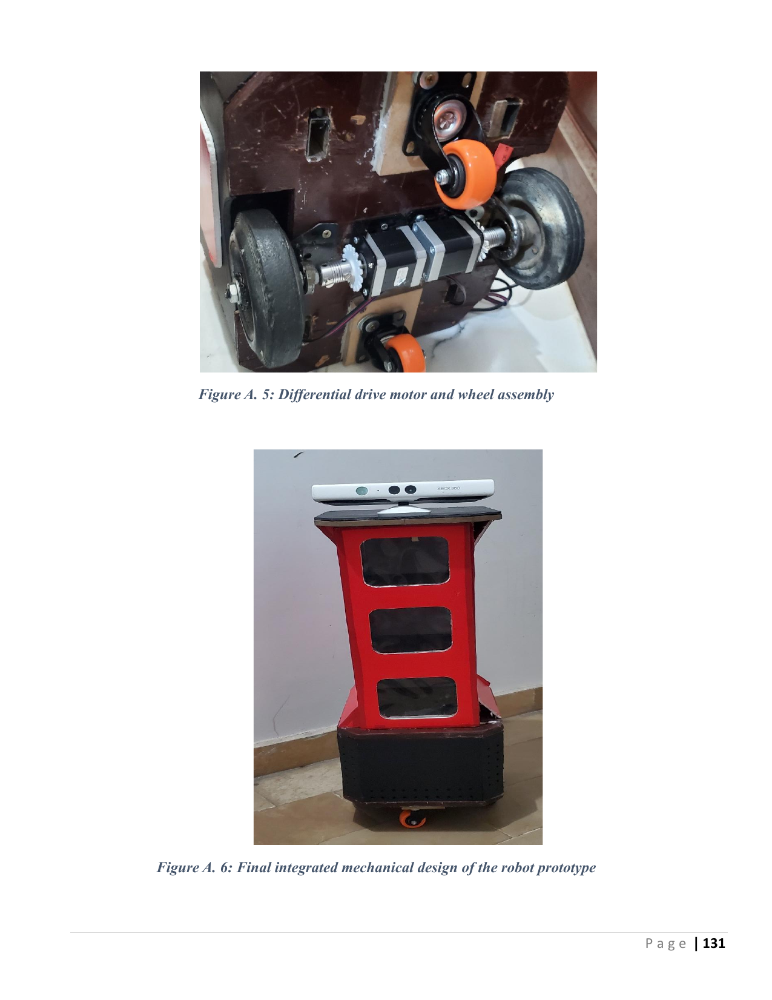
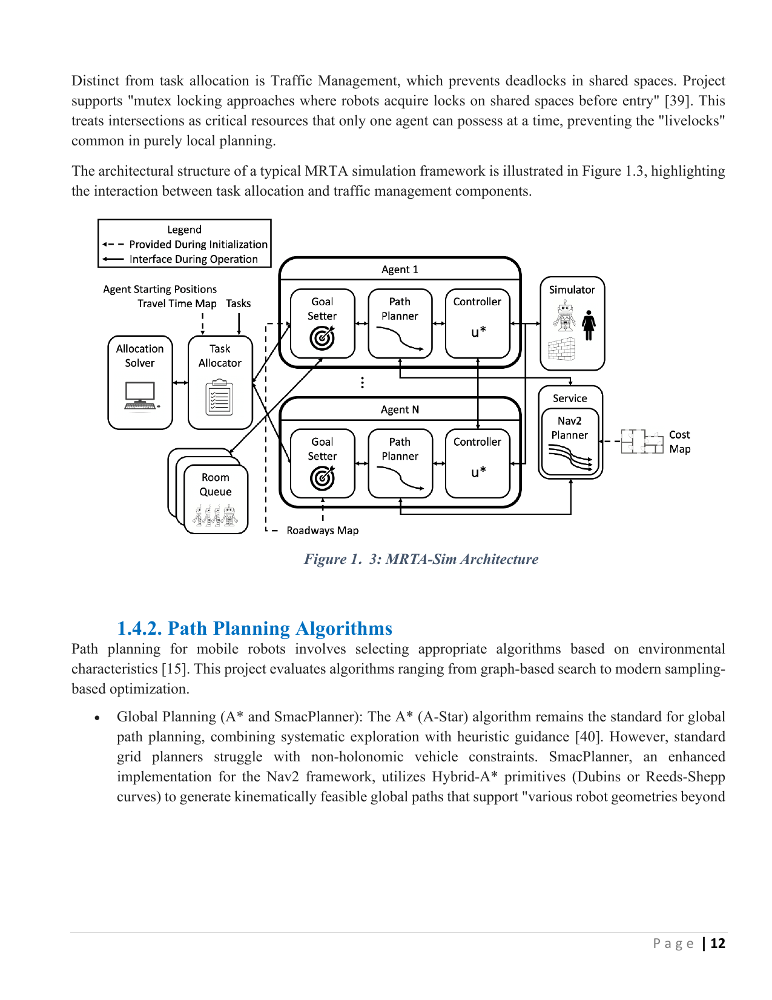
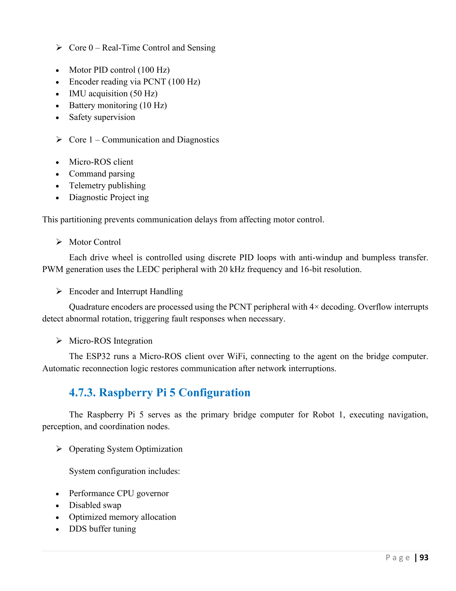

<div align="center">

<!-- BANNER — A high-quality photo of the physical robot -->


# 🤖 Smart Navigation & Coordination System for AI-Driven Multi-Agent Robotic Systems

[](https://docs.ros.org/en/humble/)
[](https://www.python.org/)
[](https://isocpp.org/)
[](https://www.docker.com/)
[](https://github.com/ultralytics/ultralytics)
[](https://www.espressif.com/)
[](https://www.raspberrypi.com/)
[](LICENSE)

**Bachelor's Graduation Project — Sana'a University, Faculty of Engineering**  
*Electrical Engineering · Computer and Control Engineering · February 2026*

[📄 Full Documentation](#documentation) · [🎬 Demo Videos](#demo-videos) · [🚀 Quick Start](#quick-start) · [🏗️ Architecture](#architecture) · [📊 Results](#results)

</div>

---

## 📌 Overview

This project presents the **end-to-end design, implementation, and validation** of a centralized, AI-driven multi-robot logistics system for indoor service environments — hospitals, hotels, and warehouses.

The system spans the **full engineering stack**: from custom PCB fabrication and ESP32 firmware, to ROS 2 navigation, AI perception, fleet management, and voice-based human-robot interaction — all containerized with Docker and validated in both simulation and real hardware.

> **What makes this unique:** Very few student projects go from soldering a PCB → writing FreeRTOS firmware → building a ROS 2 navigation stack → integrating YOLOv8 → deploying a fleet manager → adding voice AI → implementing RFID door mechanisms. This project does all of that.

---

## 🎬 Demo Videos

| Demo | Description | Link |
|------|-------------|------|
| 🗺️ **SLAM Mapping** | Two robots building a shared map in real-time using SLAM Toolbox | [Watch →](https://drive.google.com/drive/folders/1-9L6LYLV3B_W_U3SomK1VmOPT8XbXjZW) |
| 🚗 **Autonomous Navigation** | Multi-robot nav with MPPI controller avoiding dynamic obstacles | [Watch →](https://drive.google.com/drive/folders/1-9L6LYLV3B_W_U3SomK1VmOPT8XbXjZW) |
| 👁️ **YOLOv8 Obstacle Detection** | RGB-D camera feed with live bounding box detection | [Watch →](https://drive.google.com/drive/folders/1-9L6LYLV3B_W_U3SomK1VmOPT8XbXjZW) |
| 🎙️ **Voice HRI** | Whisper speech recognition → Gemini AI → robot task execution | [Watch →](https://drive.google.com/drive/folders/1-9L6LYLV3B_W_U3SomK1VmOPT8XbXjZW) |
| 🔑 **RFID Door Mechanism** | Automated door access using RFID technology for secure areas | [Watch →](https://drive.google.com/drive/folders/1-9L6LYLV3B_W_U3SomK1VmOPT8XbXjZW) |
| 🤖 **Full System Run** | Complete end-to-end demo: voice command → task → navigation → completion | [Watch →](https://drive.google.com/drive/folders/1-9L6LYLV3B_W_U3SomK1VmOPT8XbXjZW) |

---

## 🏗️ Architecture

The system uses a **hierarchical three-tier control architecture**:

<div align="center">

</div>

```text
┌─────────────────────────────────────────────────────────────┐
│              HIGH-LEVEL CONTROL LAYER                        │
│   Fleet Management System (FMS) · SMrTa Solver              │
│   Human-Robot Interaction (Whisper + Gemini API)            │
│   Task Queue · Traffic Coordination · Battery Management     │
└────────────────────────┬────────────────────────────────────┘
                         │ ROS 2 DDS / WiFi
┌────────────────────────▼────────────────────────────────────┐
│              MID-LEVEL BRIDGE LAYER (Raspberry Pi 5)         │
│   ROS 2 Humble · Nav2 · SLAM Toolbox · AMCL                 │
│   YOLOv8 Perception · RGB-D Fusion · Behavior Trees         │
└────────────────────────┬────────────────────────────────────┘
                         │ Micro-ROS / UART
┌────────────────────────▼────────────────────────────────────┐
│              LOW-LEVEL CONTROL LAYER (ESP32)                 │
│   FreeRTOS Dual-Core · Closed-Loop Stepper Control          │
│   Encoder Feedback · Safety E-Stop · GPIO Management        │
│   RFID Reader Integration for Door Access                   │
└─────────────────────────────────────────────────────────────┘
```

---

## 🎙️ Voice Interaction & RFID

### Voice-Driven HRI Pipeline
The system features a robust voice interaction pipeline that allows users to command the robots using natural language.
- **Wake Word:** "Hey Kamil"
- **ASR:** OpenAI Whisper for Arabic/English speech recognition.
- **Intent Parsing:** Google Gemini API for natural language understanding.
- **Feedback:** Real-time speech feedback to the user.

<div align="center">

</div>

### RFID Door Mechanism
To navigate through secure indoor environments, the robots are equipped with RFID technology.
- **Automated Access:** Robots detect RFID-enabled doors and trigger the opening mechanism.
- **Secure Navigation:** Ensures robots can only enter authorized zones.

---

## 🛠️ Tech Stack

### Software & AI
| Category | Tools / Frameworks |
|----------|--------------------|
| **Robot OS** | ROS 2 Humble Hawksbill |
| **Navigation** | Nav2, SLAM Toolbox, AMCL, SmacPlanner, MPPI Controller |
| **AI / Perception** | YOLOv8 (Ultralytics), OpenCV, RGB-D Sensor Fusion |
| **Voice & NLP** | OpenAI Whisper (ASR), Google Gemini API |
| **Fleet Management** | SMrTa (Google's Multi-Robot Task Allocator), SQLite |
| **Simulation** | Gazebo (hospital world), RViz2 |
| **Containerization** | Docker, docker-compose |
| **Embedded** | Micro-ROS, FreeRTOS, C++ |
| **Languages** | Python 3.10+, C++17 |

### Hardware
| Component | Role |
|-----------|------|
| **Raspberry Pi 5** | Mid-level compute: ROS 2, Nav2, perception |
| **ESP32** | Low-level real-time control (FreeRTOS, Micro-ROS) |
| **Microsoft Kinect V1** | RGB-D sensing for SLAM + YOLOv8 |
| **NEMA17 Stepper Motors** | Differential-drive locomotion |
| **TB6600HG Driver (4.5A)** | Motor driver |
| **Custom PCB** | Designed from scratch — power distribution + motor control |
| **RFID Module** | Door access mechanism |
| **Optical Encoders** | Closed-loop odometry |
| **USB Microphone + Speaker** | Voice HRI interface |

---

## 📁 Repository Structure

```text
├── firmware/                   # ESP32 / Micro-ROS code (Motor Control, RFID)
├── ros2_ws/                    # ROS 2 Workspace (Navigation, Perception, Fleet, HRI)
├── hardware/                   # PCB design (KiCad) & Mechanical (STL)
├── simulation/                 # Gazebo worlds and URDF models
├── docs/                       # Detailed documentation & Full PDF
├── media/                      # Images and GIFs for README
└── results/                    # Performance metrics and plots
```

---

## 🚀 Quick Start

### Prerequisites
- Docker + docker-compose
- A machine with Ubuntu 22.04 (or the Docker environment handles it)

### 1. Clone the Repository
```bash
git clone https://github.com/Asoomkamel/MARS-Multi-Agent-Robotic-System.git
cd MARS-Multi-Agent-Robotic-System
```

### 2. Launch the Simulation (Docker)
```bash
cd docker
docker-compose up --build
```

---

## 📊 Results

Key performance metrics from simulation and real-world testing:

| Metric | Result |
|--------|--------|
| **Navigation Success Rate** | ≥ 95% in simulation, stable in hardware |
| **SLAM Map Accuracy** | Consistent across hospital-sized environment |
| **YOLOv8 Detection** | Real-time inference at target FPS on Raspberry Pi 5 |
| **Task Allocation Efficiency** | SMrTa outperforms greedy baseline in multi-task scenarios |
| **Voice Command Latency** | End-to-end ASR → task assignment pipeline |
| **Multi-Robot Coordination** | Zero deadlocks across all traffic zone tests |
| **ESP32 Real-Time Control** | Deterministic FreeRTOS loop with encoder feedback |

---

## 👥 Team

| Name | Student ID |
|------|-----------|
| Mutasim Makin Al-Kamil | 202270192 |
| Osama Muhammed Maaodhah | 202270222 |
| Mamdouh Abdul Fattah Al-Samei | 202270377 |
| Hussain Abdul Moeen Al-Samei | 202270380 |

**Supervisor:** Prof. Dr. Abdulraqib Abdo Asaad  
**Institution:** Sana'a University — Faculty of Engineering, Electrical Department  
**Degree:** B.Sc. Electrical Engineering (Computer and Control Engineering)

---

## 📄 Documentation

The full graduation project document (157 pages) is available in [`docs/graduation_report.pdf`](docs/graduation_report.pdf).

---

## 📜 License

This project is released under the [MIT License](LICENSE).

---

<div align="center">

**⭐ If this project helped or inspired you, please give it a star!**

*Built with passion, persistence, and too many late nights — by engineering students from Yemen 🇾🇪*

</div>
